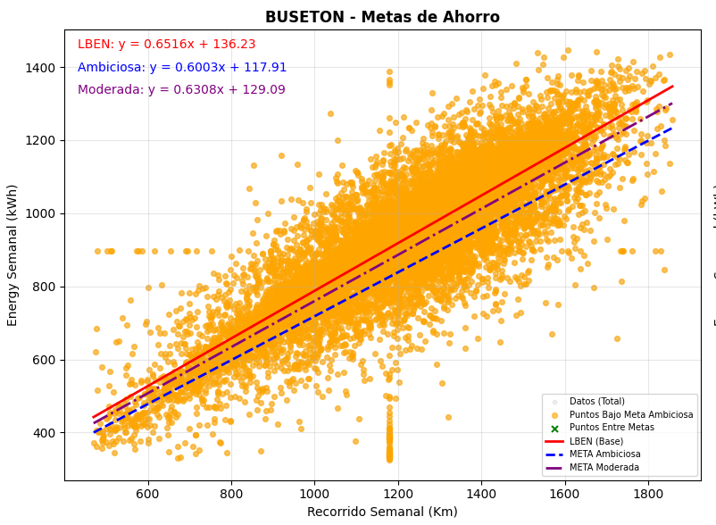

# 🔋 Línea Base Energética (LBEN) - Autobuses Eléctricos | ISO 50001

Construcción de la **Línea Base Energética** para flota de autobuses eléctricos conforme a la norma **ISO 50001**.

---

## 🎯 Objetivo del Proyecto

El objetivo principal de este proyecto es **establecer la Línea Base Energética (LBEN)** de la flota de autobuses eléctricos, permitiendo:

- Cuantificar el consumo energético real en función del recorrido (km)
- Identificar el comportamiento energético por tipo de vehículo
- Definir metas de ahorro energético **realistas y medibles**
- Cumplir con los requisitos de la norma **ISO 50001** para el Sistema de Gestión de la Energía
- Facilitar el seguimiento y mejora continua del desempeño energético de la flota

Se construyeron modelos de regresión lineal que relacionan el **consumo de energía (kWh)** con el **recorrido semanal (km)**, a partir de los cuales se definieron dos niveles de meta:

- **Meta Moderada**: Objetivo inicial, realista y alcanzable
- **Meta Ambiciosa**: Objetivo de alto desempeño energético

---

## 📊 Notebook Principal

👉 **[Abrir el Jupyter Notebook](./LBEN%20ISO50001%20BUSES%20ELECTRICOS.ipynb)**

> GitHub renderiza el notebook automáticamente. Solo haz clic en el enlace.

---

## 📈 Ejemplo de Resultado: Modelos de Regresión

A continuación se muestra un ejemplo de las gráficas de regresión generadas en el análisis, donde se visualiza la **Línea Base Energética (LBEN)** junto con las metas de ahorro:

---

## 📁 Contenido del repositorio

| Archivo | Descripción |
|--------|-----------|
| `LBEN ISO50001 BUSES ELECTRICOS.ipynb` | Notebook completo con todo el análisis |
| `imagen_regre.png` | Gráfica de regresión con LBEN y metas de ahorro |

---

## 🛠️ Tecnologías utilizadas

- **Python**
- Pandas & NumPy
- Scikit-learn (Regresión Lineal)
- Matplotlib & Seaborn
- PostgreSQL (`psycopg2`)
- Jupyter Notebook
- python-dotenv (gestión segura de credenciales)

---

## 📌 Notas importantes

- Las credenciales de la base de datos se gestionan mediante un archivo `.env` (no se suben al repositorio por seguridad).
- Se recomienda implementar inicialmente la **Meta Moderada**, por ser un objetivo alcanzable y sostenible.
- El análisis se realizó con datos agrupados semanalmente para mayor robustez estadística.

---

## 👤 Autor

**Anderson Sarmiento Briceno**
